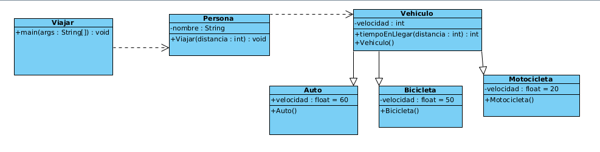

Estudiante: Javier Alcalde

1. Primer diagrama de clases realizado

2. Comencé definiendo las clases, las cuales finalmente
fueron 6, siendo viajar la clase main. hay dependencias
entre viajar, persona y vehiculo, esta ultima a su vez
teniendo sub-clases auto bicicleta y motocicleta.
3. Actualización: ...